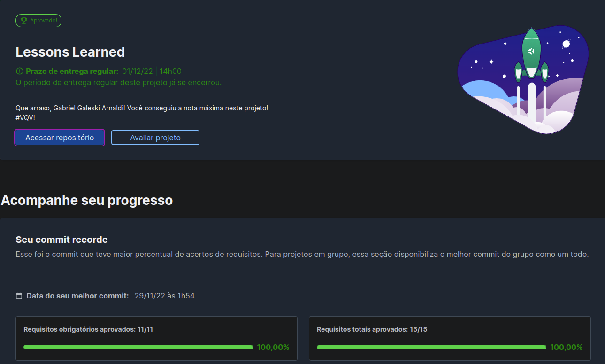

# :notebook_with_decorative_cover: Lessons Learned!

 

# :clipboard: About

Primeiro Projeto realizado no curso da Trybe, no qual foi concluido com 100% dos requisitos.

No projeto, era pedido para se desenvolver uma pagina estatica utilizando apenas html semantico e css.

 

# :hammer_and_wrench: Skills & Tools

- HTML5
- CSS3
